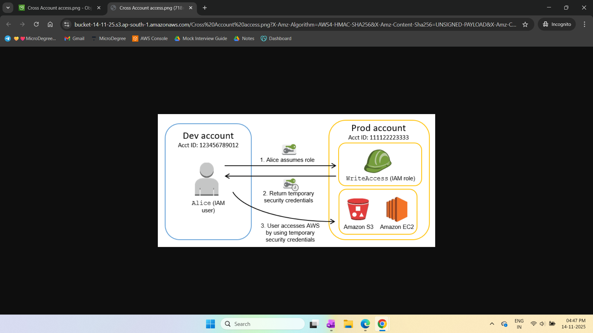

# Cross Account Access using IAM Role

Enable cross-account access to an S3 bucket using AWS Identity and Access Management (IAM) roles. This guide covers authentication, authorization, IAM users vs roles, and step-by-step deployment.

---

## Concepts

### Authentication
Confirming the identity of a user, typically via username and password.

### Authorization
Determines what actions an authenticated user or service is allowed to perform on AWS resources.

### IAM User vs IAM Role

| IAM User | IAM Role |
|----------|----------|
| Permanent identity | Temporary identity (e.g., 1 hour in Free Tier) |
| Long-term credentials | Temporary credentials |
| Direct AWS Console access | Assumed by users or services |

### Policies

| Feature | Customer Managed Policy | Inline Policy |
|---------|-----------------------|---------------|
| Reusability | Yes, can attach to multiple entities | No, embedded in a single entity |
| Management | Standalone with versioning | Managed within entity, no versioning |
| Lifecycle | Exists until deleted | Deleted with associated entity |

Cross-account access allows users or services from one account to securely access resources in another by assuming a role.

---

## Deployment Steps

See full deployment instructions [here](docs/deployment-steps.md).


## Project Structure
```
cross-account-access/
│
├── docs/
│ ├── deployment-steps.md 
│ └── screenshots/
│ 	├── cross_account_access.png # Screenshot of cross-account access
│ 	└── cross_account_architecture.png # Architecture diagram
├── README.md 
└── LICENSE 
```
## Architecture Diagram

**Cross Account Access Architecture**  


## Screenshots

**Cross Account Access Using IAM Role**  


## License

MIT License. See `LICENSE` file for details.


